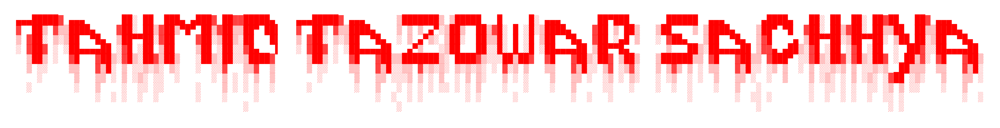

<h1 align="center">Hi 👋, I'm MadMax</h1>
<h3 align="center">Just exploring life and different opportunity</h3>

  

  

- 🔭 I’m currently working on **NOting**

- 🌱 I’m currently learning **Life**

- 👯 I’m looking to collaborate on **OPen Source**

- 💬 Ask me about **games**

- 📫 How to reach me **ttazowar@gmail.com**

<h3 align="left">Connect with me:</h3>

<h3 align="left">Languages and Tools:</h3>

          

<h3 align="left">Support:</h3>

  

&nbsp;

<picture>
  <source media="(prefers-color-scheme: dark)" srcset="https://raw.githubusercontent.com/arnav7777/arnav7777/output/github-snake-dark.svg">
  <source media="(prefers-color-scheme: light)" srcset="https://raw.githubusercontent.com/arnav7777/arnav7777/output/github-snake-light.svg">
  
</picture>
